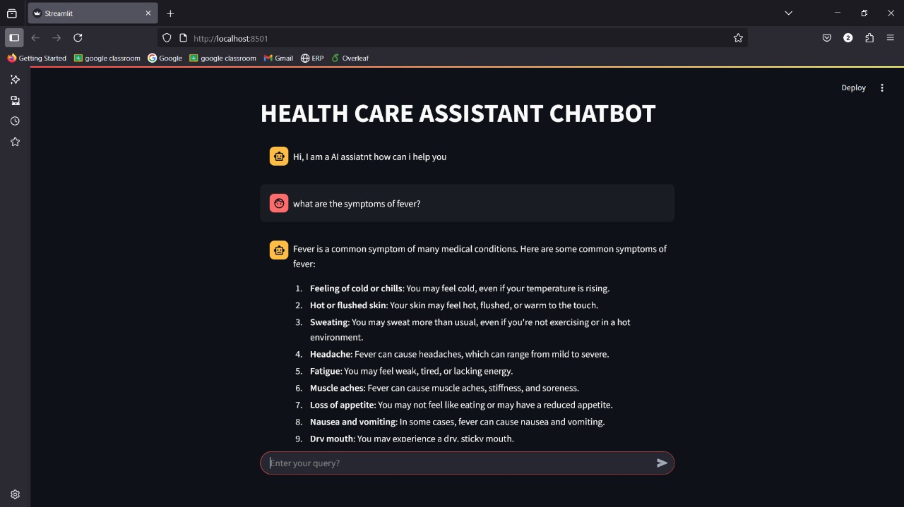

# 🩺 Health Care Assistant Chatbot

A conversational AI-powered assistant designed to provide **accurate, user-friendly, and medically relevant answers**. This project combines a **domain-specific fine-tuned model** (using TinyLlama + LoRA) with a **general-purpose LLM**, and blends their responses via a third LLM to provide a final enhanced answer.

## Key Features

- **Dual Model Inference**:
  - A fine-tuned medical model (`TinyLlama-1.1B-Chat` with LoRA)
  - A general-purpose LLM (via LangChain agents with Groq)

- **Response Fusion**:
  - Uses a third LLM to combine outputs from both models.
  - Prioritizes medical accuracy and human-readable responses.

- **Streamlit Frontend**:
  - Chat-style UI for interacting with the assistant.
  - Session memory support via `st.session_state`.

-  **LangChain Agent Integration**:
  - Uses tools like `Wikipedia`, `Arxiv`, `DuckDuckGo` via LangChain for general lookup (via `agent_making.py`).

- **LangSmith Tracking**:
  - Tracks and visualizes conversation flows
  - Uses:
    ```python
    os.environ["LANGSMITH_TRACING"] = "true"
    os.environ["LANGSMITH_PROJECT"] = "Project_name"
    os.envirom["LANGSMITH_API_KEY"] = "YOUR_LANGSMITH_API_KEY"
    ```

---

##  Getting Started
```bash

# 1. Clone the repo
git clone https://github.com/M-Hemanth1977/Healthcare_Assistant_Chatbot.git
cd Healthcare_Assistant_Chatbot

# 2. Setup environment
python -m venv venv
venv\Scripts\activate      # On Windows
pip install -r requirements.txt

# 3. Create a .env file and add:
hf_api_key=your_huggingface_token
langsmith_api_key=your_langsmith_token
grok_api_key=your_qrok_key

# 4. Launch
streamlit run main.py
```

### Chatbot UI
---



---
